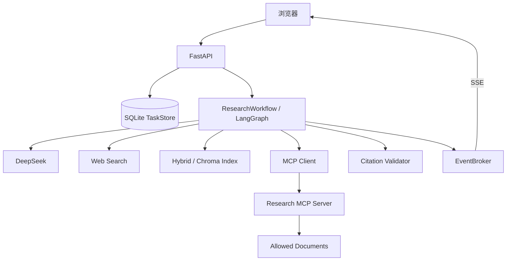

# 结业项目架构

```mermaid
flowchart TD
    UI[浏览器] --> API[FastAPI]
    API --> STORE[(SQLite TaskStore)]
    API --> WF[ResearchWorkflow / LangGraph]
    WF --> LLM[DeepSeek]
    WF --> SEARCH[Web Search]
    WF --> INDEX[Hybrid / Chroma Index]
    WF --> MCP[MCP Client]
    MCP --> SERVER[Research MCP Server]
    SERVER --> DOCS[Allowed Documents]
    WF --> CITE[Citation Validator]
    WF --> EVENTS[EventBroker]
    EVENTS -->|SSE| UI
```

关键边界：

- 模型只能提出工具调用，宿主程序校验并执行。
- Retriever 只返回 Source，不负责写报告。
- Writer 只能引用输入上下文中已经存在的 source_id。
- API 负责任务生命周期，Workflow 负责研究状态转换。
- MCP Server 只暴露只读能力，并限制文件与网络访问范围。

